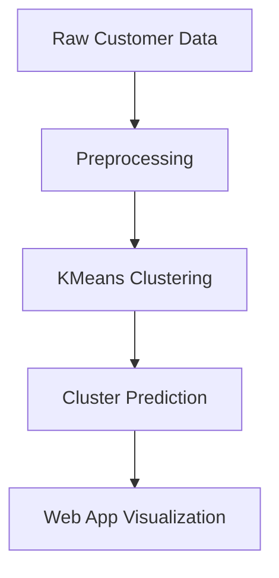
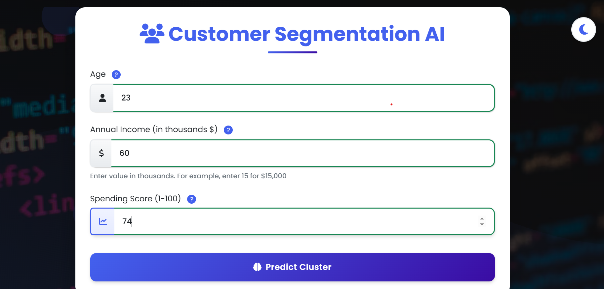
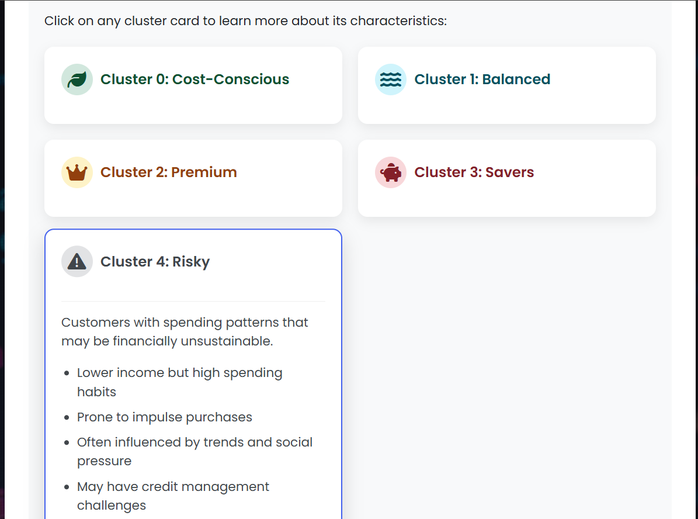
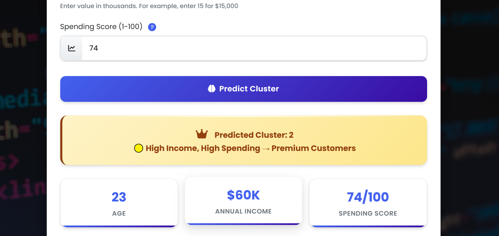

# Customer-Segmentation-Ai-app
🤖 Customer Segmentation AI - ML-powered web app that classifies customers into strategic clusters using K-means algorithm. Input age, income &amp; spending score to get instant segmentation with actionable insights. Built with Django, Python, Bootstrap &amp; Chart.js. Perfect for marketing analytics! 🚀📊


# 🤖 Customer Segmentation AI

[](https://github.com/WaleedAfridi-1/Customer-Segmentation-Ai-app/stargazers)
[](https://github.com/WaleedAfridi-1/Customer-Segmentation-Ai-app/network/members)
[](LICENSE)
[](https://github.com/your-username/customer-segmentation-ai/issues)
[](https://github.com/your-username/customer-segmentation-ai/pulls)
[](https://customer-segmentation-ai-app-production-1bb2.up.railway.app/)

---

## 🌟 Overview

> An advanced **AI-powered web application** that segments customers using **KMeans clustering** based on Age, Annual Income, and Spending Score.  
It provides **real-time predictions**, **visual insights**, and **marketing recommendations** to businesses.

🚀 **Live Demo**: [Customer Segmentation AI](https://customer-segmentation-ai-app-production-1bb2.up.railway.app/)

---

## ✨ Features

✅ Real-time **customer cluster prediction**  
✅ Interactive **charts and visualizations**  
✅ **Dynamic explanations** for each cluster  
✅ **Dark/Light theme toggle** 🌙☀️  
✅ **Business-ready marketing recommendations**  
✅ **Deployed on Railway** for global access 🌍  

---

## 🧠 Machine Learning Workflow



---

## 🖼️ Screenshots

| Input Form | Cluster Result | Insights |
|------------|----------------|----------|
|  |  |  |

---

## 🛠️ Tech Stack

- **Frontend**: HTML5, CSS3, Bootstrap, JS, AOS, Chart.js  
- **Backend**: Django /(Python)  
- **ML Model**: KMeans (Scikit-learn)  
- **Deployment**: Railway.app  

---

## ⚡ Installation

```bash
# Clone the repo
git clone https://github.com/your-username/customer-segmentation-ai.git

# Navigate to project
cd customer-segmentation-ai

# Install dependencies
pip install -r requirements.txt

# Run server
python manage.py runserver
```

---

## 📊 Cluster Insights

<details>
<summary>Click to expand</summary>

- **Cluster 0 (Cost-Conscious 🟢)** → Budget shoppers, value discounts  
- **Cluster 1 (Balanced 🔵)** → Medium income, consistent spenders  
- **Cluster 2 (Premium 🟡)** → High-income, luxury buyers  
- **Cluster 3 (Savers 🔴)** → Wealthy but cautious spenders  
- **Cluster 4 (Risky ⚪)** → Low-income, high spenders (unsustainable)  

</details>

---

## 🚀 Roadmap

| Stage | Feature | Status |
|-------|----------|--------|
| ✅ | Basic ML Model (KMeans) | Done |
| ✅ | Web App with Forms & Results | Done |
| ✅ | Railway Deployment | Done |
| 🔜 | Add **real customer dataset integration** | Planned |
| 🔜 | Enhance **visual dashboards** | Planned |
| 🔜 | Deploy on **Docker + Kubernetes** | Future |

---

## 🤝 Contribution

We ❤️ contributions!  
- Fork the repo  
- Create your feature branch (`git checkout -b feature/AmazingFeature`)  
- Commit changes (`git commit -m 'Add some AmazingFeature'`)  
- Push branch (`git push origin feature/AmazingFeature`)  
- Open a Pull Request  

---

## 👨‍💻 Author

**Waleed Afridi**  
[](https://github.com/WaleedAfridi-1)  

[](https://linkedin.com/in/waleed-afridi-3931a8333)  

---

## 📜 License

This project is licensed under the **MIT License** - see the [LICENSE](LICENSE) file for details.

---

⭐ If you like this project, give it a star on GitHub to support!  
